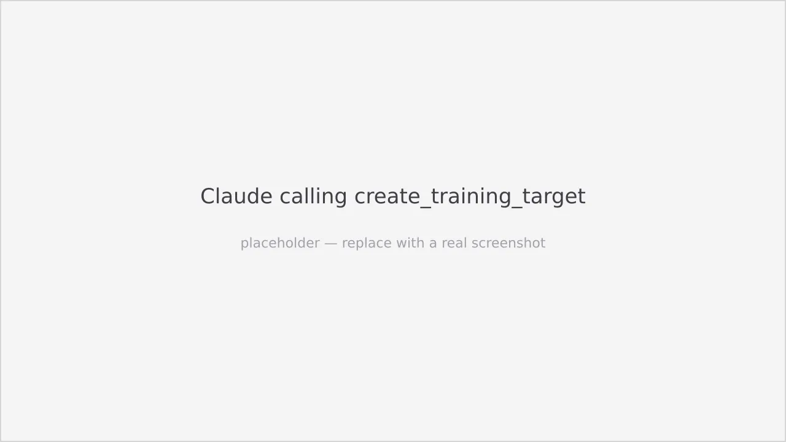

Once polar-flow-mcp is running and your Polar account is linked, you manage
workouts through plain-language Claude conversations. This guide covers the
intensity vocabulary and the create / list / edit / delete flow, with worked
examples.



:::tip
Install the [polar-flow skill](/guides/install-the-skill/) first. It teaches Claude
which tool to call and the exact parameter shapes, so you can speak in plain
language rather than tool arguments.
:::

## Intensity vocabulary

Polar Flow uses five heart-rate zones (Z1–Z5). When creating training targets,
you specify intensity using either a **label** (preferred) or a numeric zone.

| Label | HR zone | Coaching meaning |
|-------|---------|-----------------|
| `easy` | Z1–2 | Recovery pace. Conversational, fully aerobic. Shakeout runs, warm-ups, recovery jogs. |
| `aerobic` | Z2 | Easy aerobic / base building. Comfortable, sustainable for long runs. Bulk of weekly volume. |
| `tempo` | Z3 | Steady-state, comfortably hard. Marathon to half-marathon effort. |
| `threshold` | Z4 | Lactate threshold. Hard, sustainable for ~30–60 min. Classic 1km repeats, cruise intervals. |
| `vo2max` | Z5 | Very hard. Short repeats (1–5 min) at near-maximal aerobic effort. |

The label → zone mapping is a fact of the API, not a coaching opinion. Prefer
labels in conversation — they are more readable. Use a numeric zone
(`hr_zone: 4`) only when someone explicitly says "zone 4"; `hr_zone` wins if both
are supplied.

## Create a workout

Ask Claude for the session you want:

> "Create a 5x1km threshold session with 2-minute recovery for next Thursday"

Claude resolves the date, maps "threshold" to Z4, and calls
`create_training_target` with the phase tree:

```json
{
  "name": "5x1km Threshold",
  "date": "2026-05-21",
  "time": "18:00",
  "sport_id": 1,
  "phases": [
    { "type": "warmup", "duration_s": 600 },
    {
      "type": "repeat",
      "reps": 5,
      "goal": { "distance_m": 1000 },
      "intensity": { "label": "threshold" },
      "recovery": { "duration_s": 120 }
    },
    { "type": "cooldown", "duration_s": 300 }
  ]
}
```

The new target shows up in the Polar Flow diary immediately, and Claude reports
the target ID so you can reference it later.

Two things worth knowing about the structure:

- `repeat` blocks need **at least 2 reps**. A single continuous effort is a
  *simple run* (see below), not a `repeat`.
- Warm-up and cool-down are **not** added automatically — they're a coaching
  choice. The only defaults the tool itself applies are `time` = `18:00` and
  `sport_id` = `1` (running).

See the [`create_training_target` reference](/reference/mcp-tools/#create_training_target)
for the full argument schema.

## Create a simple run (VOLUME target)

For an easy run with no interval structure, you don't need phases at all — just
a total duration or distance:

> "Put an easy 35-minute run on Friday"

```json
{
  "name": "Easy 35 min",
  "date": "2026-06-14",
  "duration_s": 2100,
  "sport_id": 1
}
```

This is a **VOLUME** target: set `duration_s` **or** `distance_m` at the top
level and omit `phases`. (A VOLUME target with neither is rejected.)

## List upcoming workouts

> "What do I have planned this week?" / "Show me my workouts for the next two weeks"

Claude calls `list_training_targets` with `from_date` set to today and `to_date`
set to the end of the requested range (default: today through +30 days), then
formats the result as a readable summary with each target's ID, name, date, and
sport.

## Edit a workout

`update_training_target` is a **full replace** — there are no patch semantics.
To change one field, Claude first reads the target with `get_training_target`,
modifies the returned body, then writes it back with the same shape plus the
`target_id`. Just ask:

> "Move Thursday's threshold session to Friday at 07:00"

## Delete a workout

> "Delete the threshold session on Thursday" / "Remove the workout with ID 12345"

If you didn't give an ID, Claude lists matching targets, confirms which one you
mean (name + date), then calls `delete_training_target`. If the target was
already removed (e.g. through the Polar app), Claude tells you plainly — that is
not an error.

## Worked examples

### Simple interval session

> "Create a 5x1km threshold session with 2-minute recovery for next Thursday"

One workout with warmup, five 1km threshold repeats with 2-minute recoveries,
and a cooldown, scheduled for that Thursday.

### Mixed-zone workout

> "3x1km at threshold, then 2x500m at vo2max, this Saturday"

```json
{
  "name": "Threshold + VO2max ladder",
  "date": "2026-05-15",
  "phases": [
    { "type": "warmup", "duration_s": 600 },
    {
      "type": "repeat", "reps": 3,
      "goal": { "distance_m": 1000 },
      "intensity": { "label": "threshold" },
      "recovery": { "duration_s": 90 }
    },
    {
      "type": "repeat", "reps": 2,
      "goal": { "distance_m": 500 },
      "intensity": { "label": "vo2max" },
      "recovery": { "duration_s": 180 }
    },
    { "type": "cooldown", "duration_s": 300 }
  ]
}
```

### Building a marathon plan iteratively

> "Build me a 12-week marathon plan starting in three weeks"

For a multi-session plan, Claude asks clarifying questions first (peak mileage,
long-run day, rest days), proposes week 1 for your review, then creates sessions
one week at a time after confirmation. This keeps you in control and prevents
accidental calendar pollution.

## What the tools do not support (yet)

- **Pace targets** — `create_training_target` supports HR zones (Z1–Z5) and
  unstructured phases. Pace-based phases exist in the underlying API but aren't
  wired through to the MCP layer yet.
- **Power targets** — same. The OpenAPI spec covers `POWER_ZONES` for cycling but
  the current MCP tool only emits `HEART_RATE_ZONES` / `NONE`.
- **Manual phase transitions** — every phase defaults to `AUTOMATIC` change type.
  The underlying API also supports `MANUAL` (wait for user input) but the MCP
  tool doesn't expose this yet.
- **Activity uploads** — this server can read completed sessions (summary +
  details), but it does not create them from device data. Polar's app/watch is
  the source of truth. (You *can* log a manual result — see
  [`create_training_session`](/reference/mcp-tools/#create_training_session).)
- **Polar account creation or device sync** — outside this server's scope.
