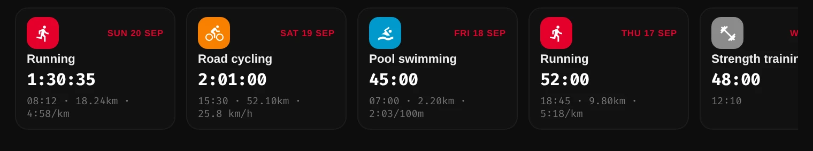
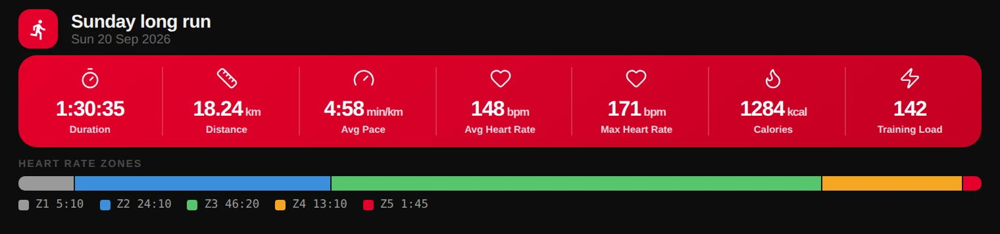
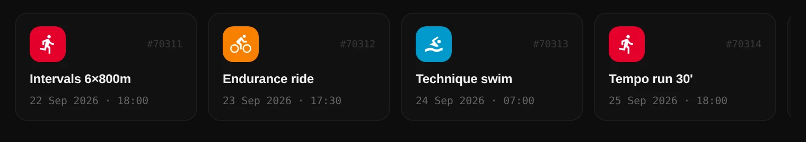
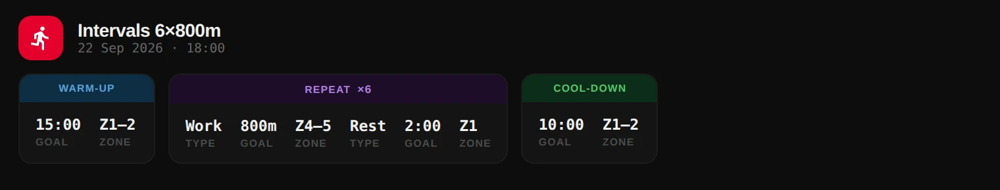
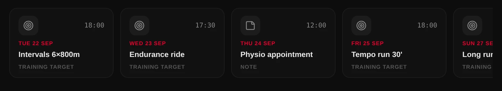
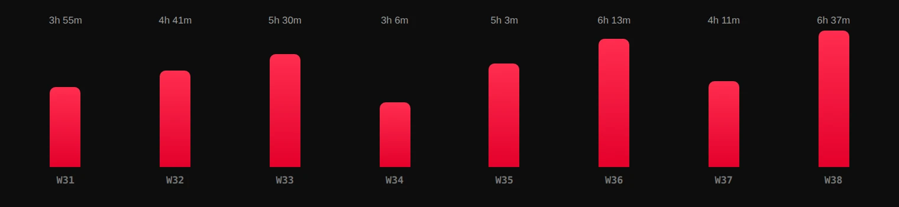
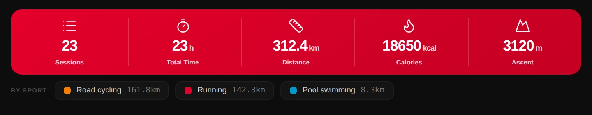
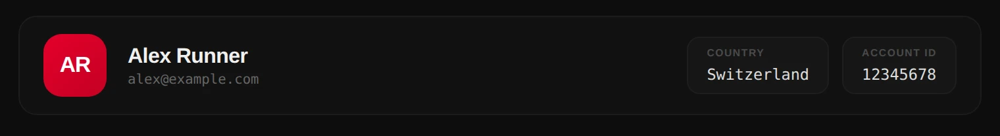

Hosts that support [MCP Apps](https://modelcontextprotocol.io/) render most
tool results as an inline widget instead of raw JSON. The five UIs are embedded
in the binary and served as `ui://polar-flow/*.html` resources; each tool
advertises its UI in `_meta.ui.resourceUri`. Hosts without MCP-app support get
the same data as the usual text/JSON result.

The screenshots below use sample data.

## Sessions — `sessions.html`

Tools: `list_training_sessions`, `get_training_session_summary`,
`get_training_session_details`.

The list renders one card per session, newest first:

Clicking a card calls `get_training_session_summary` from inside the widget
and drills into the summary — duration, distance, pace or speed (per sport), heart rate, calories,
training load and time in each heart-rate zone:

## Training targets — `targets.html`

Tools: `list_training_targets`, `get_training_target`,
`create_training_target`, `update_training_target`.

A single target shows its phases — warm-up, repeat blocks with work and rest,
cool-down — with each goal and heart-rate zone:

## Calendar — `calendar.html`

Tools: `get_calendar_events`, `get_calendar_week_summary`.

## Progress — `progress.html`

Tool: `get_progress_summary`.

## User — `user.html`

Tool: `get_user_info`.

