Hosts that support [MCP Apps](https://modelcontextprotocol.io/) render most
tool results as an inline widget instead of raw JSON. The nine UIs are embedded
in the binary and served as `ui://polar-flow/*.html` resources; each tool
advertises its UI in `_meta.ui.resourceUri`. Hosts without MCP-app support get
the same data as the usual text/JSON result.

The screenshots below use sample data.

## Sessions — `sessions.html`

Tools: `list_training_sessions`, `get_training_session_summary`,
`get_training_session_details`, `edit_training_session`.

The list renders one card per session, newest first:

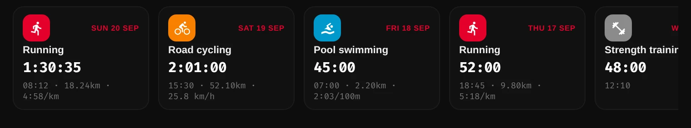

Clicking a card calls `get_training_session_summary` from inside the widget
and drills into the summary — duration, distance, pace or speed (per sport), heart rate, calories,
training load and time in each heart-rate zone, plus the session's feeling
(1–5 dots) and note when set. `edit_training_session` returns the edited
session in this same summary view:

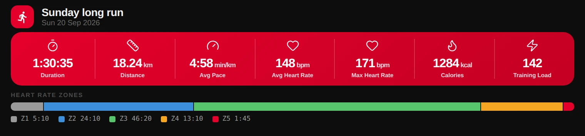

**Details ›** under the summary — or a `get_training_session_details` result —
opens the detail view: the totals, the heart-rate zone bar, an intervals table
when the session was started from a planned target (one row per rep: time,
distance, pace or speed, HR, power, target zone and the share of time spent in
it), laps when recorded, and the heart-rate, pace (or speed), power and
altitude curves with the reps marked along the top. Hovering the curves reads
out the values at that moment.

The curves are not part of the tool result. The widget fetches them itself
with `get_training_session_samples` at about 600 points, so the per-second data
never enters the conversation.

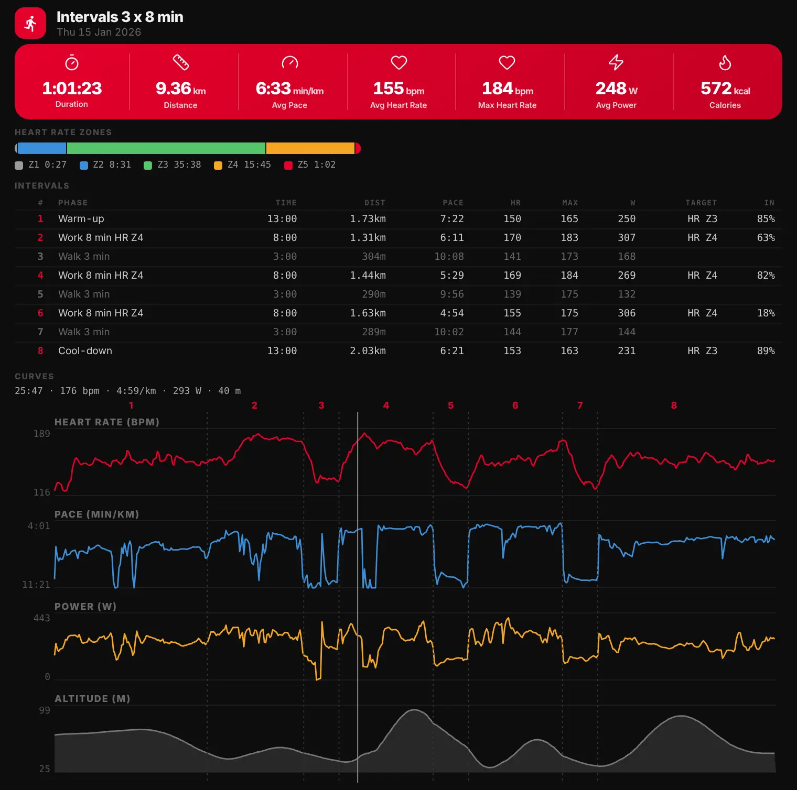

## Training targets — `targets.html`

Tools: `list_training_targets`, `get_training_target`,
`create_training_target`, `update_training_target`.

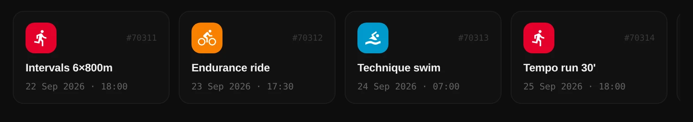

A single target shows its phases — warm-up, repeat blocks with work and rest,
cool-down — with each goal and heart-rate zone:

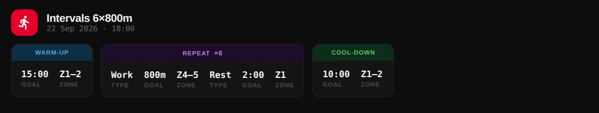

## Favorites — `favorites.html`

Tools: `list_favorites`, `get_favorite`, `create_favorite`, `update_favorite`,
`rename_favorite`, `set_favorite_sport`, `save_target_as_favorite`,
`schedule_favorite`.

The list shows one card per favorite with its sport, type (volume, phased,
route) and goal (distance, duration, calories). A single favorite shows its
description and, for phased favorites, the same phase cards as a training
target. `schedule_favorite` shows a confirmation with the new target id, date
and time.

Imported routes appear in the list, but `import_route` and `get_route` have no
widget yet: they return text/JSON only.

## Calendar — `calendar.html`

Tools: `get_calendar_events`, `get_calendar_week_summary`.

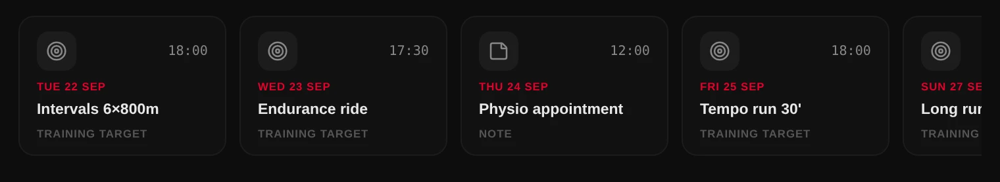

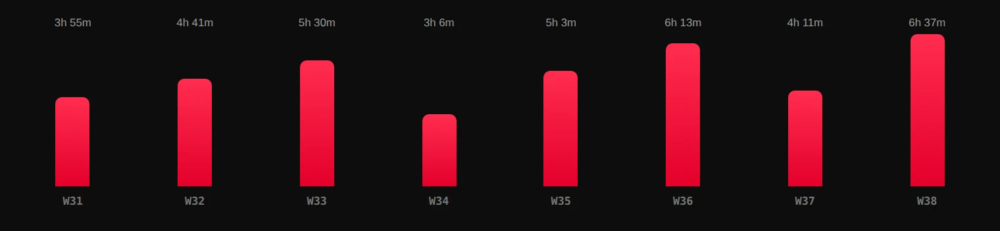

## Progress — `progress.html`

Tool: `get_progress_summary`.

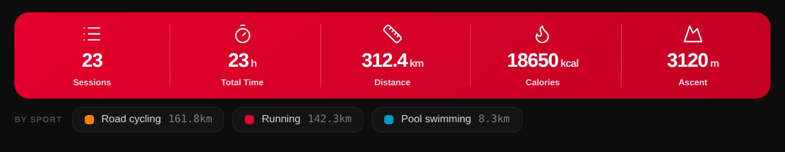

## User — `user.html`

Tool: `get_user_info`.

## Training zones — `zones.html`

Tools: `get_training_zones`, `create_sport_profile`, `update_training_zones`
(the write tools add a line saying what was saved).

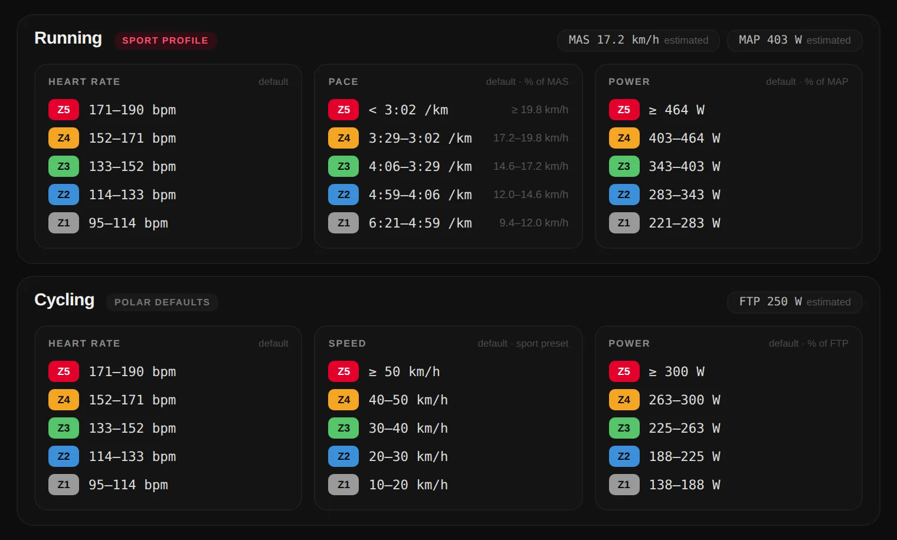

## Daily activity — `activity.html`

Tool: `get_daily_activity`. A range shows steps per day and each day's time by
intensity; a single day shows its headline numbers and the intraday activity
and heart-rate curves.

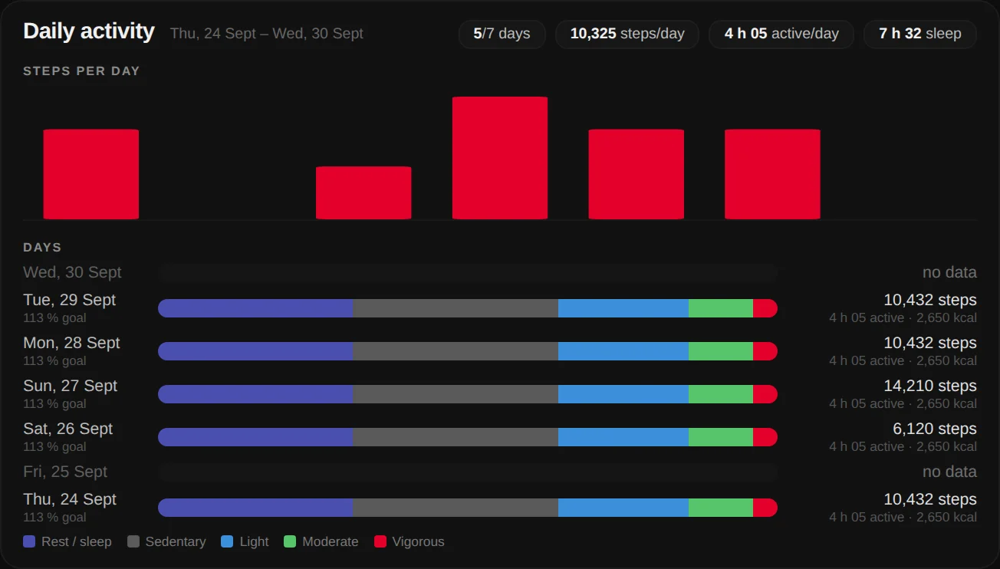

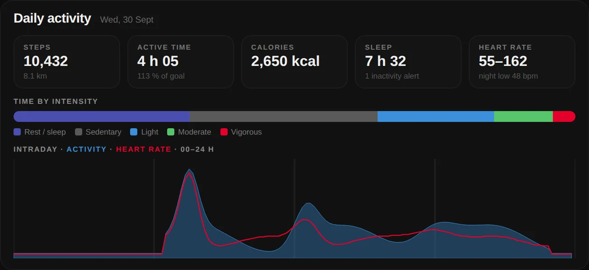

## Sleep — `sleep.html`

Tool: `get_sleep`. One row per night: a hypnogram strip (light / deep / REM /
awake), time asleep, bed and wake times, Sleep Score and continuity, with
averages for the range.

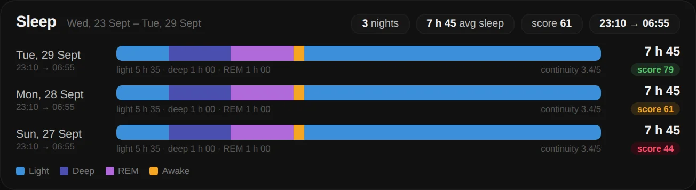

## Notices — every UI

A call with no data to show renders a notice card instead of staying on
"Loading…":

- **Rejected** (red): the tool returned an error, e.g. an argument over
  Polar's limit. The card shows the error text.
- **Nothing to show** (blue): a plain statement such as
  `No target with id 7.` These results carry a
  `{"type": "notice", "kind": "notice", "message": …}` structured payload.
- **Cancelled** (grey): the user declined a confirmation
  (`"kind": "cancelled"`), or the host cancelled the call.

If no result reaches the UI within 20 seconds, it says so; a result that
arrives later still replaces the card.
